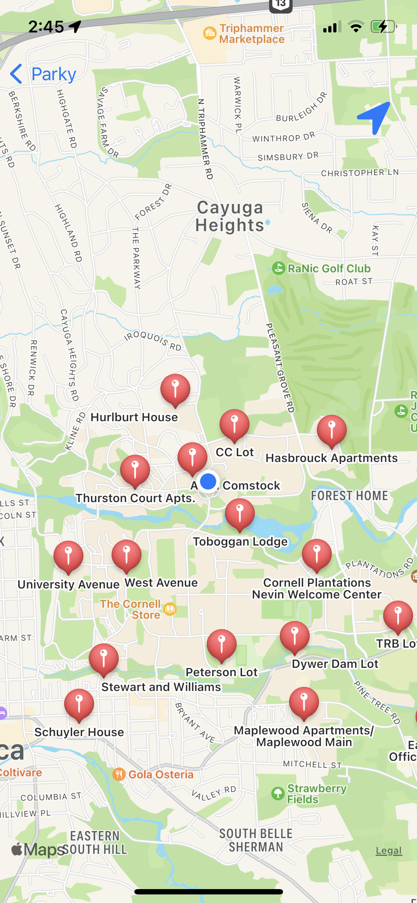

# Parky - Your Parking Assistant @ Cornell

## Description

Parky tells the current parking lot availability near Cornell University. The main view shows a table of the information of all parking lots, including photos, names, locations, fees, and open status. Besides, Parky presents a detailed view when a table cell is selected. The detail view shows all information in the table as well as user comments and the location of the parking lot. Furthermore, a map view shows the user's location as well as all parking lot locations on the map.

  
  
  

## Features

- Users can "like" a parking lot by either tapping the “heart” in the table cell or the "heart" in the detailed view.
- Centering on user's location and zooming are available in the map view.
- The comments in a detailed view controller automatically rolls and can also be scrolled manually. 
- Users can write a comment with an optional photo. After submission, the comment will be displayed as the first.

The backend code and API specs can be found [here](https://github.com/vcccaat/Cornell-Parking).

## Swift Technical Highlights

- `SnapKit` is used for layouts on all pages.
- `UITableView` is used to list all parking lot information in the main view.
- The "like" status is synced between the table cell and the detailed view by delegation.
- The map view consisting of an `MKMapView` is pushed.
- The detailed view is presented.
- The comments are implemented using a `UICollectionView`.

## Networking and Integration with API
- All the information is retrieved from the backend database by `GET`.
- Submitted comments and photos are created in the database by `POST`.

Pull requests and issue reports are welcome!

